.. -*- coding: utf-8 -*-
.. _beta_adic_set:

===================
BetaAdicSet in Sage
===================

.. MODULEAUTHOR:: Paul Mercat, and Dominique Benielli
                  Labex Archimede - I2M -
                  AMU Aix-Marseille Universite

The present tool BetaAdicSet is a convenient tool to describe sets like Rauzy fractals and quasicrystals associated to substitutions, and more generally sets described by :math:`\beta`-expansion with digits in a regular language.

Introduction and Definitions
----------------------------

Subtitution
~~~~~~~~~~~

Given a substitution, let's say for example the Fibonnacci substitution:

.. MATH::
    \left\{
    \begin{array}{rcl}
    a & \mapsto & ab \\
    b & \mapsto & a
    \end{array}
    \right.

Up to replace the substitution by a power, a fixed point always exists. Here we have the following unique fixed point:

:math:`abaababaabaababaababaabaababaabaababaaba...`

This infinite sequence has a lot of interesting properties in general.
If we replace letters by intervals of convenient lengths, we get a self-similar tiling of :math:`\mathbf R_+`.
Convenient lengths are given by the non-negative coefficients of a Perron eigenvector of the incidence matrix :math:`M` of the substitution.
Here this matrix is

.. MATH::
    M = \begin{pmatrix}
    1 & 1 \\
    1 & 0
    \end{pmatrix}
  
and :math:`\begin{pmatrix} 1 \\ \beta-1 \end{pmatrix}` is an eigenvector for the Perron eigenvalue :math:`\beta`, which is the golden number.

Self-similar tiling of :math:`\mathbf R_+`
~~~~~~~~~~~~~~~~~~~~~~~~~~~~~~~~~~~~~~~~~~

The set of points that appears at the boundaries of intervals in this self-similar tiling are elements of :math:`\mathbf Q(\beta)`, and this set of points have very strong properties, because it is a non-periodic self-similar Meyer set.
Here, we get the points
  
:math:`0, 1,\ \beta,\ \beta + 1,\ \beta + 2,\ 2\beta + 1,\ 2\beta + 2,\ 3\beta + 1,\ 3\beta + 2,\ 3\beta + 3, \ 4\beta + 2,\ 4\beta + 3, ...`

To get this set of points, we start from :math:`0` and read the fixed point: 
we add :math:`1` each time we read a letter :math:`a` and we add :math:`\beta-1` each time we read a letter :math:`b`.
  
Automaton
~~~~~~~~~

This set of points of :math:`\mathbf Q(\beta)` is described by the automaton :math:`\mathcal{A}` of the following figure describing the quasicrystal 
associated to the Fibonnacci substitution:

.. PLOT::
   :width: 30%

    a = DetAutomaton([('a', 'b', '1'), ('a', 'a', '0'),('b', 'a', '0')], i='a')
    sphinx_plot(a)

The initial state of this automaton :math:`\mathcal{A}` is the one labelled by letter 'a', and the two states 'a' and 'b' are final states.
The language :math:`L_{\mathcal{A}}` recognized by an automaton :math:`\mathcal{A}` is defined as the set of sequences of labels of paths from the initial state to a final state.
Here, the language of :math:`\mathcal{A}` is exactly the set of words over the alphabet :math:`\{0,1\}` that does not contain the subword :math:`11`.

The set of points is obtained from :math:`\beta` and from the automaton by:

.. MATH::
    \{\sum_{i=0}^n a_i \beta^i\ |\ a_n a_{n-1} ... a_1 a_0 \in L_{\mathcal{A}}\}.

The self-similar tiling of :math:`\mathbf R_+` is obtained by taking the embedding of :math:`\mathbf Q(\beta)` in :math:`\mathbf R` corresponding to the Perron eigenvalue of the incidence matrix :math:`M`.
If we look at the others embeddings, corresponding to eigenvalues less than :math:`1` we get a bounded set whose adherence is called Rauzy fractal of the substitution.
Here there is a unic such embedding, which is a real one, corresponding to the root of :math:`x^2-x-1` between :math:`-1` and :math:`1`.
The Rauzy fractal is here the interval :math:`[-1, \varphi]` of :math:`\mathbf R` where :math:`\varphi` is the golden number (i.e. greatest root of :math:`x^2-x-1`).

Main Definitions
----------------

Broken line
~~~~~~~~~~~

Consider :math:`s` a substitution, or in others words, a word morphism over a finite alphabet :math:`A = \{1, 2, ..., n\}`.
Up to replace :math:`s` by a power, we can assume that :math:`s` has a fixed point :math:`\omega`.
    
We defined the \defi{broken line} associated to :math:`\omega` as the subset of :math:`\mathbf Z^n` defined by

.. MATH::

    \{ {\begin{pmatrix}
    \text{number of occurences of } 1 \text{ in } \omega_k \\
    \text{number of occurences of } 2 \text{ in } \omega_k \\
    \vdots \\
    \text{number of occurences of } n \text{ in } \omega_k
    \end{pmatrix}
    \in \mathbf Z^n
    } 
    {k \in \mathbf N} \}
  
where :math:`\omega_k` is the prefix of length :math:`k` of the infinite word :math:`\omega`.

This broken line is very interesting since it is a geometrical object which completely encode the substitution and is stable by multiplication by the incidence matrix.
And we get the quasicrystal or the Rauzy fractal by projecting this set of point.

Rauzy fractal
~~~~~~~~~~~~~

The Rauzy fractal is the closure of the projection of the broken line to the contracting space along the expanding line.

Expanding line and contracting space
^^^^^^^^^^^^^^^^^^^^^^^^^^^^^^^^^^^^

The "expanding line" has dimension :math:`1` for Pisot numbers, but it can have greater dimension for other Perron numbers.

Let :math:`M_s` be the incidence matrix of the substitution :math:`s`.
By definition the coefficient :math:`(i,j)` of this matrix is the number of occurrences of the letter :math:`j` in the word :math:`s(i)`.
By Perron-Frobenius theorem, there exists an eigenvector :math:`v \in (\mathbf R_+)^n`, unique if the matrix is irreducible, for an eigenvalue :math:`\lambda` which is the spectral radius of :math:`M_s`,
and moreover we can assume that :math:`v \in (\mathbf Q(\lambda))^{n}`.
    
We can directly define the projection of the broken line in :math:`\mathbf Q(\lambda)`, by the following. 

.. MATH::

    \{ Q_\omega = \sum_{k=1}^N v_{a_k}\ |\ N \in \mathbf N,\ a_1 a_2 ... a_N \text{ prefix of } \omega \text{ of length } N \}.
    
This set is invariant by multiplication by the Perron eigenvalue :math:`\lambda` and gives a self-similar tiling of :math:`\mathbf R_+`.
The definition of :math:`Q_\omega` depends of the choice of an eigenvector.
We prefer to choose an eigenvector whose coefficients belongs to the integer ring :math:`\mathcal O_\lambda`, in order to have :math:`Q_\omega \subset \mathcal O_\lambda`.
    
For :math:`\mathbf Q(\lambda)`, there are natural contracting and expanding spaces for the multiplication by :math:`\lambda`.
Indeed, consider the biggest sets :math:`P_+` and :math:`P_-` of places (i.e. equivalence class of absolute values) 
of :math:`\mathbf Q(\lambda)` such that

.. MATH::

    	\forall v \in P_+,\ |{\lambda}|_v > 1 \quad \text{ and } \quad \forall v \in P_-,\ |{\lambda}|_v < 1.
  
If :math:`\lambda` is an algebraic unit, the set :math:`P_+` corresponds to roots of the minimal polynomial of :math:`\lambda` greater than :math:`1` in absolute value, counting two conjugate complexes only once,
and it is the same for :math:`P_-` with the roots of modulus less than :math:`1`.
    
For each place :math:`v`, we define a space :math:`E_v` as the completion of :math:`\mathbf Q(\lambda)` for the absolute value :math:`v`.
If :math:`v` is a real place (i.e. corresponding to a real root or the minimal polynomial of :math:`\lambda`), then :math:`E_v = \mathbf R`.
If :math:`v` is a complex place (i.e. corresponding to two conjugated complex roots or the minimal polynomial of :math:`\lambda`), then :math:`E_v = \mathbf C`.
Otherwise, :math:`E_v` is a :math:`p`-adic space, which is a finite extension of the :math:`p`-adic field :math:`\mathbf Q_p` (which is the completion of :math:`\mathbf Q` for the :math:`p`-adic absolute value).
    
    
We can define the expanding space

.. MATH::

    	E_\lambda^+ := \prod_{v \in P_+} E_v,

and the contracting one

.. MATH::

    	E_\lambda^- := \prod_{v \in P_-} E_v.

Let's take :math:`\sigma_+` and :math:`\sigma_-` some embeddings of :math:`\mathbf Q(\lambda)`
into the spaces :math:`E_+` and :math:`E_-` respectively.
We will also denote by :math:`\sigma_\beta` the maximal real embedding when :math:`\beta` is a Perron number.
      
So Rauzy fractal of the substitution :math:`s` can be define as the adherence of :math:`\sigma_-(Q_\omega)` in :math:`E_{\lambda}^-`.

..  Set :math:`P`
    ^^^^^^^^^^^^^
    Let :math:`\beta` be a Pisot number (not necessarly unit), and let :math:`P \subseteq E_\beta^-`.
    The set :math:`P` is arbitrarily approximated by Rauzy fractals, for the Hausdorff distance, associated to :math:`\beta^n`, 
    if and only if :math:`P` is bounded and :math:`0 \in \overline{P}`.

:math:`\beta`-adic sets
~~~~~~~~~~~~~~~~~~~~~~~

A :math:`\beta`-adic set, for an number :math:`\beta`, is a subset of :math:`\mathbf Q(\beta)` of the form

.. MATH::

        { \mathbf Q_{\beta,L} := \{ \sum_{i=0}^n a_i \beta^i} { n \in \mathbf N,\ a_0 a_1 ... a_n \in L } \}.

where :math:`L` is a regular language over a finite alphabet :math:`\Sigma \subset \mathbf Q(\beta)`.
It is represented in Sage by the class :class:`BetaAdicSet` which contains a number :math:`b` for :math:`\beta`, and the data of a :class:`DetAutomaton` `a` recognizing the language :math:`L`.

Some Properties
^^^^^^^^^^^^^^^

For a fixed algebraic number :math:`\beta` with no conjugate of modulus one,
the set of :math:`\beta`-adic sets is stable by

* intersection
* union
* complementary (in another :math:`\beta`-adic set)
* Minkowski sum (i.e. the sum of two :math:`\beta`-adic sets is a :math:`\beta`-adic set)
* multiplication by an element of :math:`\mathbf Q(\beta)`
* translation by an element of :math:`\mathbf Q(\beta)`
* adherence, interior, boundary, for the topology of :math:`\mathcal O_\beta` induced by :math:`E_-`. 

The fact that :math:`\beta`-adic sets come naturally to describe quasicrystals arising from substitutions
and has a lot of nice properties show that it is an interesting fundamental object.
    

Remark
^^^^^^

We see from theses properties that we can construct :math:`\beta`-adic sets with any shape in the contracting space :math:`E^-`.
This allows us to construct Rauzy fractals of any shape: the :math:`\beta`-adic set comes from a substitution for the Pisot number :math:`\beta^k` if and only if it is invariant by multiplication by
:math:`\beta^k` and it is a Meyer set in the expanding direction.

Construction of a domain exchange
---------------------------------
The first step, to construct a substitution from a quasicrystal, is to construct a domain exchange which describe the shift on the quasicrystal.

Let :math:`\beta` be a Pisot number (eventually non unit), and let :math:`Q \subseteq \mathbf Q(\beta)` such that :math:`\sigma_+(Q)` is a quasicrystal of :math:`\mathbf R` or :math:`\mathbf R^+`.
Then there exists a domain exchange with a finite number of pieces such that the union of the pieces is :math:`Q`.
Moreover, this domain exchange is conjugated to the shift on :math:`\sigma_+(Q)`.

.. figure:: /media/echange_rond.jpg
  :scale: 50%
  :align: center
  :alt: domain exchange

  Construction of a domain exchange in the unit disk, for the integer ring :math:`\mathcal O_\beta`,
  where :math:`\beta` is the Tribonnacci number. 
  :math:`\color{red}{-2\beta^2+2\beta}`, :math:`\color{orange}{\beta^2-\beta-1}`, :math:`\color{lime}{\beta-1}`, :math:`\color{green}{1}`,  :math:`\color{cyan}{-\beta^2+2\beta+1}`, :math:`\color{blue}{\beta^2-\beta}`, :math:`\color{magenta}{\beta}`

The domain exchange described in the above figure for the open unit disk gives exactly the list of Pisot numbers
(including non-unit ones) of degree :math:`3` in :math:`\mathbf Q(\beta)`,
where :math:`\beta` is the Tribonnacci number (i.e. greatest root of $x^3-x^2-x-1$).
Indeed if :math:`x` is a Pisot number of degree three in :math:`\mathbf Q(\beta)`,
the next Pisot number is obtained by looking in which piece is the conjugate :math:`\overline{x}`,
and adding the corresponding translation to :math:`x`.

For a :math:`\beta`-adic set, for a Pisot number :math:`\beta`, we can compute the domain exchange when it is finite. It is done by the class :class:`BetaAdicSet`, with method :meth:`~sage.arith.beta_adic.BetaAdicSet.domain_exchange`.

Construction of a substitution
------------------------------

If we know that a quasicrystal :math:`\sigma_+(Q)` of `\mathbf R` or :math:`\mathbf R_+` comes from the fixed point of a substitution for a Pisot number :math:`\lambda`,
it is not difficult to guess what is the substitution.
Indeed, it is enough to take intervals between two consecutive points, multiply it by :math:`\lambda`,
and see how the result is covered by others intervals.

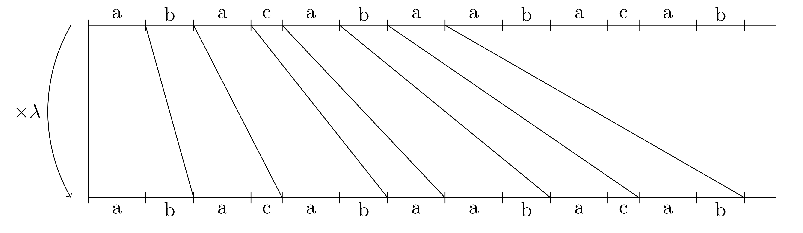

But we have to take care of the fact that one interval can have several substitutions rules,
corresponding to the fact that several letters of a substitution can give intervals of same lengths.

If we look at what happens in the contracting space :math:`E^-`, we have to do a sort of induction on :math:`\lambda Q`
for the domain exchange on :math:`Q`, and we have to iterate it up to stabilization.
But it's not really an induction : we have to distinguish between different possible 
trajectories for points in :math:`\lambda Q` before they come back to :math:`\lambda Q`,
otherwise the induction only give the same domain exchange on :math:`\lambda Q` than in :math:`Q`.

For a :math:`\beta`-adic set, for a Pisot number :math:`\beta`, we can compute the substitution when it exists. It is done by the class :class:`BetaAdicSet` , with method  :meth:`~sage.arith.beta_adic.BetaAdicSet.substitution`.

Examples of Usage of BetaAdicSet
--------------------------------

A Sierpinsky gasket
~~~~~~~~~~~~~~~~~~~

Take the Tribonnacci Pisot number :math:`\beta`, root of :math:`x^3 - x^2 - x - 1`,
and take :math:`L` the regular language defined by the following automaton.

This automaton describing the regular language describing a :math:`\beta`-adic set which is a Sierpiński
gasket union a set of non-empty interior for :math:`\beta` the Tribonnacci number.

.. PLOT::
   :width: 80%

   # automaton that describe a Sierpinsky gasket
   a = DetAutomaton([(0,2,0),(0,6,1),(2,3,1),(2,12,0),(6,7,1),(6,9,0),(3,4,1),(3,5,0),(12,13,1),(12,14,0),(7,8,0),(7,15,1),(9,10,0),(9,11,1),(4,0,0),(5,0,0),(5,0,1),(13,0,0),(13,0,1),(14,0,0),(8,0,0),(8,0,1),(15,0,1),(10,0,1),(11,0,1),(11,0,0)], i=0)

   # automaton recognizing a set of non-empty interior
   a2 = DetAutomaton([(0,1,0),(1,2,0),(2,2,0),(2,2,1)],i=0, final_states=[2])
   # multiply by b^2
   a3 = a.unshift(0, final=True).unshift(1)
   a = a2.union(a3)
   sphinx_plot(a)

Obtained by the code:

.. code-block:: Python

   # automaton that describe a Sierpinsky gasket
   a = DetAutomaton([(0,2,0),(0,6,1),(2,3,1),(2,12,0),(6,7,1),(6,9,0),(3,4,1),(3,5,0),(12,13,1),(12,14,0),(7,8,0),(7,15,1),(9,10,0),(9,11,1),(4,0,0),(5,0,0),(5,0,1),(13,0,0),(13,0,1),(14,0,0),(8,0,0),(8,0,1),(15,0,1),(10,0,1),(11,0,1),(11,0,0)], i=0)

   # automaton recognizing a set of non-empty interior
   a2 = DetAutomaton([(0,1,0),(1,2,0),(2,2,0),(2,2,1)],i=0, final_states=[2])
   # multiply by b^2
   a3 = a.unshift(0, final=True).unshift(1)
   a = a2.union(a3)
   a.plot()

We define and plot this :math:`\beta`-adic set:

.. code-block:: Python

   m = BetaAdicSet(x^3-x^2-x-1, a) #choose to work with the alphabet {0,1} and with the Tribonnacci polynomial
   m.plot(nprec=6)

.. image:: media/beta_adic_image1.png
  :scale: 80 %

The domain exchange with :math:`6` pieces, describing the shift on :math:`\beta`-adic-set can be computed:

.. code-block:: Python

   # compute a domain exchange
   l = m.domain_exchange()
   print("Exchange with %s pieces."%len(l))
   Exchange with 6 pieces.
   # plot it
   m.plot_list([a for t,a in l], nprec=6)

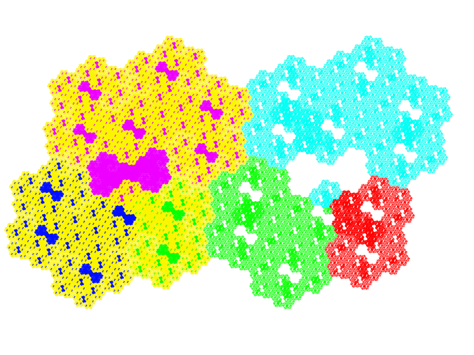

And we plot the domains after exchange

.. code-block:: Python

   # plot it after exchange
   m.plot_list([a.proj(m, t) for t,a in l], nprec=6)

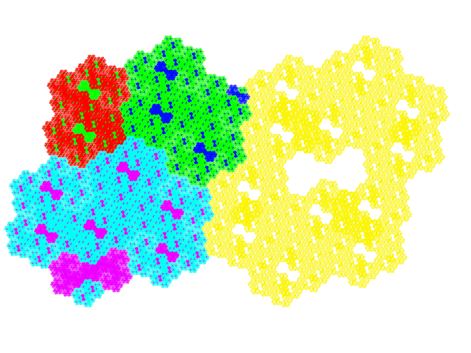

Compute the subtitution

.. code-block:: Python

   # compute a substitution whose broken line is this BetaAdicSet
   %time d = m.substitution()
   d
   CPU times: user 24 s, sys: 156 ms, total: 24.1 s
   Wall time: 24.1 s
   
   {1: [60, 6],
    2: [19],
    3: [19, 54],
    4: [50, 42],
    5: [57, 9, 58, 3],
    6: [60, 6, 40, 48],
    7: [60, 6, 53],
    8: [21, 35, 48, 60, 1],
    9: [19, 55, 5],
    10: [21, 66, 49, 60, 1],
    11: [64, 6, 15, 5],
    12: [60, 6, 63, 49, 60, 1],
    13: [53, 64, 7, 25, 4],
    14: [54, 20, 33, 4],
    15: [60, 18, 38, 3, 37, 46, 58, 2],
    16: [36, 17, 45, 41, 46, 58, 2],
    17: [64, 6, 53, 5],
    18: [60, 6, 53, 64, 1],
    19: [57, 9, 58, 3, 37, 46],
    20: [57, 9, 58, 3, 52],
    21: [34, 11, 58, 3, 37, 46],
    22: [34, 11, 58, 3, 52],
    23: [52, 41, 3, 52, 4],
    24: [64, 18, 43, 41, 46, 58, 2],
    25: [64, 18, 43, 50, 4],
    26: [57, 9, 58, 3, 37, 46, 58, 2],
    27: [57, 9, 58, 3, 52, 41, 2],
    28: [40, 48, 60, 7, 65, 47, 58, 2],
    29: [35, 48, 22, 61, 47, 58, 2],
    30: [34, 11, 58, 3, 37, 46, 58, 2],
    31: [34, 11, 58, 3, 52, 41, 2],
    32: [41, 46, 45, 41, 46, 58, 2],
    33: [41, 46, 45, 50, 4],
    34: [15],
    35: [16],
    36: [24],
    37: [26],
    38: [28],
    39: [29],
    40: [30],
    41: [32],
    42: [50, 42, 50],
    43: [13, 42, 50],
    44: [14, 42, 50],
    45: [23, 42, 50],
    46: [19, 54, 5],
    47: [21, 54, 5],
    48: [64, 6, 40, 48, 60, 1],
    49: [60, 6, 40, 48, 60, 1],
    50: [50, 42, 50, 4],
    51: [23, 42, 50, 4],
    52: [27, 44, 50, 4],
    53: [31, 39, 3, 37, 46, 58, 2],
    54: [51, 41, 3, 37, 46, 58, 2],
    55: [58, 46, 58, 3, 37, 46, 58, 2],
    56: [37, 46, 58, 3, 37, 46, 58, 2],
    57: [55],
    58: [56],
    59: [59, 12],
    60: [62, 12],
    61: [61, 8],
    62: [63, 49],
    63: [60, 49],
    64: [68, 10],
    65: [64, 49],
    66: [69, 8],
    67: [65, 8],
    68: [66, 49],
    69: [67, 49]}

And we can plot directly the Rauzy fractal from a :class:`WordMorphism` describing this subtitution:

.. code-block:: Python

    #plot the Rauzy fractal from the substitution
    s = WordMorphism(d)
    s.rauzy_fractal_plot()

.. image:: media/domain3.png
    :scale: 100 %

The Dragon Fractal
~~~~~~~~~~~~~~~~~~

.. code-block:: Python

    ################################################
    # The dragon fractal
    ################################################
    m = BetaAdicSet(1/(1+I), [0,1])
    m
    b-adic set with b root of x^2 - x + 1/2, and an automaton of 1 states and 2 letters

.. code-block:: Python

    a = m.relations_automaton(ext=True)
    a.plot()

.. PLOT::
   :width: 60%

    m = BetaAdicSet(1/(1+I), [0,1])
    a = m.relations_automaton(ext=True)
    sphinx_plot(a)

.. code-block:: Python

    mi = m.intersection_words([0], [1])
    m.plot_list([mi])

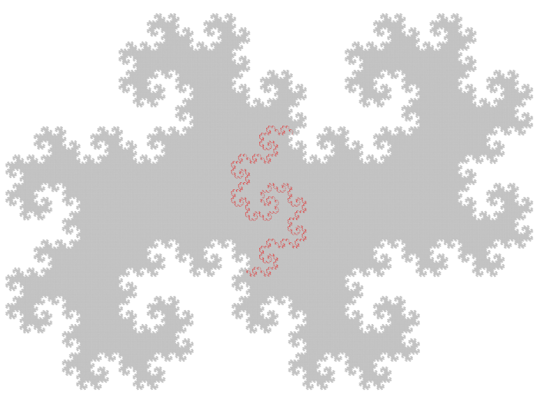

.. code-block:: Python

   mi.plot(nprec=6)

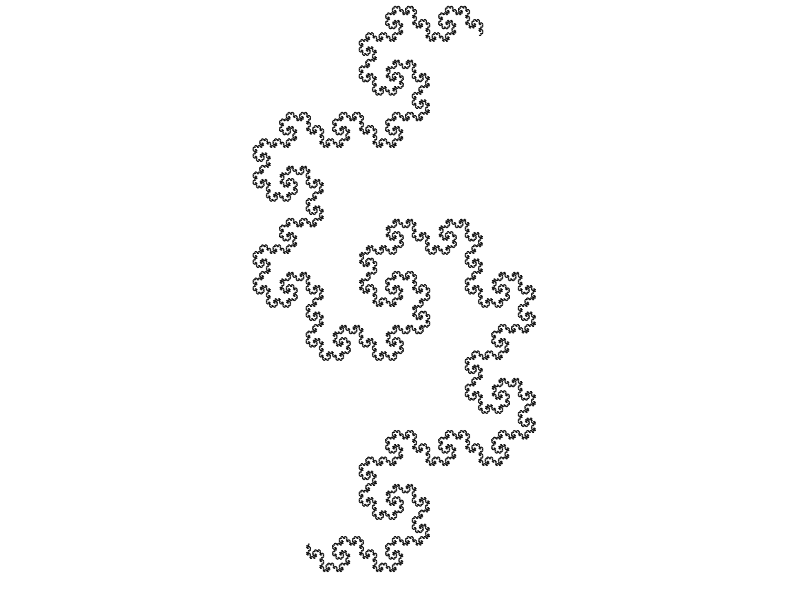

Compute the Hausdorff dimension.

.. link

::

   sage: # compute the Hausdorff dimension
   sage: mi.critical_exponent()
   log(y)/log(1.414213562373095?) where y is the max root of x^3 - x^2 - 2, and 1.414213562373095? is root of x^2 - 2.
   1.523627086202492

Any Shape
~~~~~~~~~

We can define :math:`\beta`-adic sets approximating any shape.
This can be done with the function :meth:`~sage.arith.beta_adic.approx`.
And we can also draw a :math:`\beta`-adic set with the mouse, with the class :class:`BetaAdicSet`, with the method
:meth:`~sage.arith.beta_adic.BetaAdicSet.user_draw`.
We present various examples.

Disk
----

We start by taking a simple :math:`\beta`-adic set.

.. code-block:: Python

   ######################################
   # BetaAdicSet approximating a disk
   ######################################
   #. BetaAdicSet approximating a square
   m = WordMorphism('a->ab,b->ac,c->a').DumontThomas().mirror()
   m
   b-adic set with b root of x^3 - x^2 - x - 1, and an automaton of 3 states and 2 letters

The relation automaton associated

.. PLOT::
   :width: 60%

   ######################################
   # BetaAdicSet approximating a disk
   ######################################
   #. BetaAdicSet approximating a square
   m = WordMorphism('a->ab,b->ac,c->a').DumontThomas().mirror()
   a = m.relations_automaton()
   sphinx_plot(a)

.. code-block:: Python

   pm = m.b.parent().places()[1]
   pm
   Ring morphism:
     From: Number Field in b with defining polynomial x^3 - x^2 - x - 1
     To:   Complex Field with 53 bits of precision
     Defn: b |--> -0.419643377607080 + 0.606290729207199*I

We compute an approximation of a disk included in this `\beta`-adic set:

.. code-block:: Python

   md = m.approx(14, lambda x: (pm(x).real())^2 + (pm(x).imag())^2 < .4)
   print(md)
   b-adic set with b root of x^3 - x^2 - x - 1, and an automaton of 265 states and 2 letters

.. code-block:: Python

   m.plot_list([md])

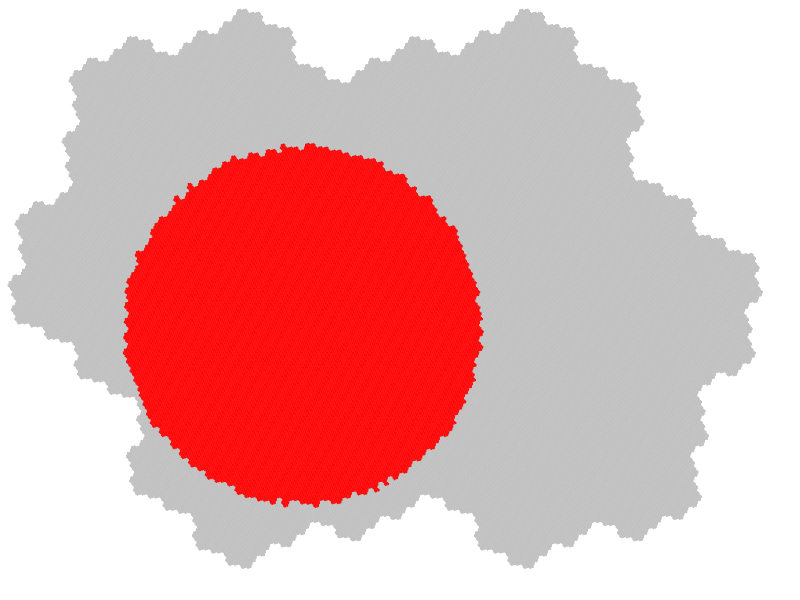

.. code-block:: Python

   md1 = md.proj(m)
   md1
   b-adic set with b root of x^3 - x^2 - x - 1, and an automaton of 253 states and 2 letters

   # domain exchange for this set
   l = md1.domain_exchange()
   print(l)
   [(1, b-adic set with b root of x^3 - x^2 - x - 1, and an automaton of 99 states and 2 letters), (b^2 - b, b-adic set with b root of x^3 - x^2
   - x - 1, and an automaton of 70 states and 2 letters), (b, b-adic set with b root of x^3 - x^2 - x - 1, and an automaton of 134 states and 2
   letters), (b + 1, b-adic set with b root of x^3 - x^2 - x - 1, and an automaton of 99 states and 2 letters), (b^2, b-adic set with b root of
   x^3 - x^2 - x - 1, and an automaton of 164 states and 2 letters), (b^2 + 1, b-adic set with b root of x^3 - x^2 - x - 1, and an automaton of
   61 states and 2 letters), (b^2 + b, b-adic set with b root of x^3 - x^2 - x - 1, and an automaton of 37 states and 2 letters), 
   (b^2 + b + 1, b-adic set with b root of x^3 - x^2 - x - 1, and an automaton of 56 states and 2 letters)]

   md1.plot_list([a for t,a in l], nprec=6)

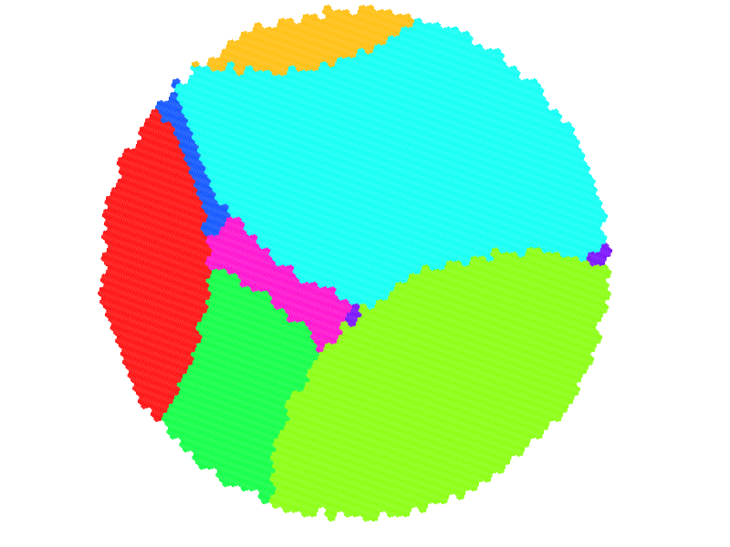

And the domain exchange after exchange

.. code-block:: Python

   # plot the domain exchange after exchange
   md1.plot_list([a.proj(md, t) for t,a in l], nprec=6)

.. image:: media/shap22.png
   :scale: 70 %

Compute a substitution whose Rauzy fractal is this approximation of disk

.. code-block:: Python

   %time d, lm = md.substitution(get_aut=True)
   d
   CPU times: user 48.6 s, sys: 783 ms, total: 49.4 s
   Wall time: 49.2 s

   {1: [248, 318, 288, 324],
    2: [168, 272, 92],
    3: [264, 274],
    4: [407, 2],
    5: [117, 99],
    6: [352, 218],
    7: [226, 235, 372, 323],
    8: [415, 134, 309, 232, 380, 291, 93],
    9: [411, 6, 232, 288, 273, 208],
    10: [374, 310, 123, 168, 292, 92],
    11: [232, 169, 273, 208],
    12: [232, 288, 281],
    13: [411, 329, 232, 288, 273, 208],
    14: [415, 339, 232, 380, 291, 93],
    15: [237],
    16: [4],
    17: [5],
    18: [152],
    19: [8],
   ...
   ...
    389: [191, 47],
    390: [191, 308],
    391: [383],
    392: [384],
    393: [373, 48, 125],
    394: [373, 252, 125],
    395: [393, 349],
    396: [394, 349],
    397: [345],
    398: [346],
    399: [352],
    400: [390],
    401: [395, 49, 126],
    402: [396, 49, 126],
    403: [401, 48, 231],
    404: [402, 48, 231],
    405: [395],
    406: [374, 164, 123],
    407: [374, 310, 123],
    408: [406, 348],
    409: [406, 350],
    410: [408],
    411: [409],
    412: [407, 344],
    413: [407, 348],
    414: [412],
    415: [413]}

.. code-block:: Python

   s = WordMorphism(d)
   s.rauzy_fractal_plot()

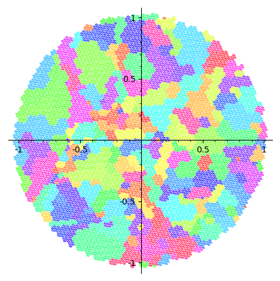

.. code-block:: Python

   m.plot_list([a for a,t in lm], nprec=6)

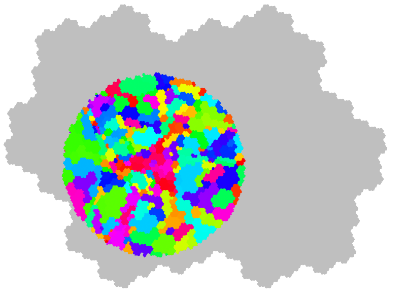

Square
------

Rauzy fractal approximating a square.

.. link

::
   

   sage: #########################################
   sage: # choose a Pisot number and an alphabet #
   sage: #########################################
   sage: pi = x^3-x^2-x-1 #Tribonacci
   sage: print(pi.roots(ring=CC))
   sage: b = pi.roots(ring=QQbar)[1][0] #we take the conjugate of modulus < 1 in order to plot the result
   sage:  m = WordMorphism('a->ab,b->ac,c->a').DumontThomas().mirror()
   sage: pm = m.b.parent().places()[1]
   sage: ########################################
   sage: # Rauzy fractal approximating a square #
   sage: ########################################
   sage: # compute a g-b-set approximating a square
   sage: # the first argument of approx() is the precision,
   sage: # and the second one is the characteristic function of the shape to approximate
   sage: # the shape must be not too big in order to be inside the set of elements that admit a b-expansion
   sage: md  = m.approx(15, lambda x: abs(pm(x).real()) < .5 and abs(pm(x).imag()) < .5 )
   sage:  m.plot_list([md])
   [(1.83928675521416, 1), (-0.419643377607081 - 0.606290729207199*I, 1), (-0.419643377607081 + 0.606290729207199*I, 1)]
   -0.4196433776070806? - 0.6062907292071993?*I

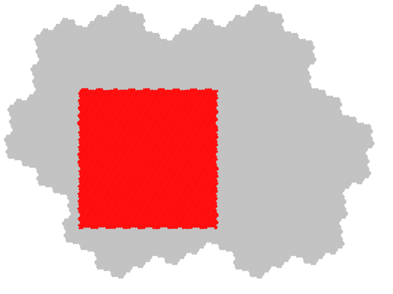

.. code-block:: Python

   md = md.proj(m)
   mdb-adic set with b root of x^3 - x^2 - x - 1, and an automaton of 241 states and 2 letters

domain exchange

.. code-block:: Python

   # domain exchange for this set
   l = md.domain_exchange()
   print(l)
   md.plot_list([a for t,a in l], nprec=6)
   [(1, b-adic set with b root of x^3 - x^2 - x - 1, and an automaton of 84 states and 2 letters), 
   (b, b-adic set with b root of x^3 - x^2 - x - 1, and an automaton of 142 states and 2 letters), 
   (b + 1, b-adic set with b root of x^3 - x^2 - x - 1, and an automaton of 128 states and 2 letters),
   (b^2, b-adic set with b root of x^3 - x^2 - x - 1, and an automaton of 168 states and 2 letters), 
   (b^2 + 1, b-adic set with b root of x^3 - x^2 - x - 1, and an automaton of 115 states and 2 letters), 
   (b^2 + b, b-adic set with b root of x^3 - x^2 - x - 1, and an automaton of 84 states and 2 letters), 
   (b^2 + b + 1, b-adic set with b root of x^3 - x^2 - x - 1, and an automaton of 91 states and 2 letters)]

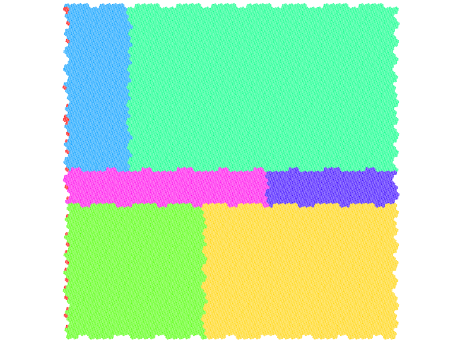

The projection

.. code-block:: Python

   # plot the domain exchange after exchange
   md.plot_list([a.proj(md, t) for t,a in l], nprec=6)

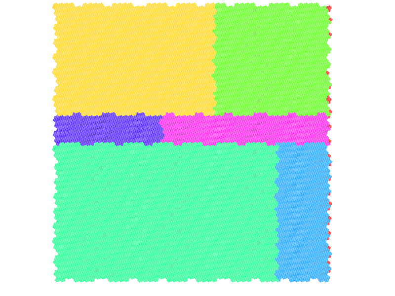

.. code-block:: Python

   d , lm = md.substitution(get_aut=True)
   d
   {1: [244, 131, 200, 174],
    2: [265, 160, 206],
    3: [31, 1, 262],
    4: [314, 72, 132, 265, 86],
    5: [77, 174, 121],
    6: [100, 278, 184, 74, 94],
    7: [298, 308, 203, 277, 124, 217, 105],
    8: [189, 244, 40, 77, 186, 121],
    9: [255, 275, 239, 74],
    10: [56, 69, 1, 262],
    11: [25, 154, 241, 261],
    12: [117, 258, 288],
    13: [301, 66, 157],
    14: [301, 66, 26],
    15: [301, 20, 28],
    16: [201, 140, 22],
    17: [201, 290, 8],
    18: [77, 186, 121],
    19: [255, 304, 152, 239, 74, 93],
    20: [196, 296, 291, 217, 105],
    21: [129, 296, 123, 216, 106],
    22: [244, 43, 77, 174, 121],
   ...
   ...
    302: [194, 303, 16],
    303: [194, 303, 39],
    304: [274, 178],
    305: [274, 219],
    306: [201, 290, 293, 18],
    307: [201, 290, 294, 18],
    308: [210, 235, 103],
    309: [210, 236, 103],
    310: [297, 309],
    311: [210, 234, 103],
    312: [210, 234, 169],
    313: [210, 234, 252],
    314: [297, 311],
    315: [297, 312]}

.. code-block:: Python

    s = WordMorphism(d)
    s.rauzy_fractal_plot()

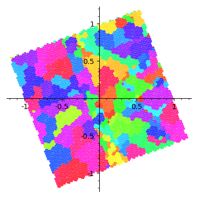

.. code-block:: Python

    m.plot_list([a for a,t in lm], nprec=6)

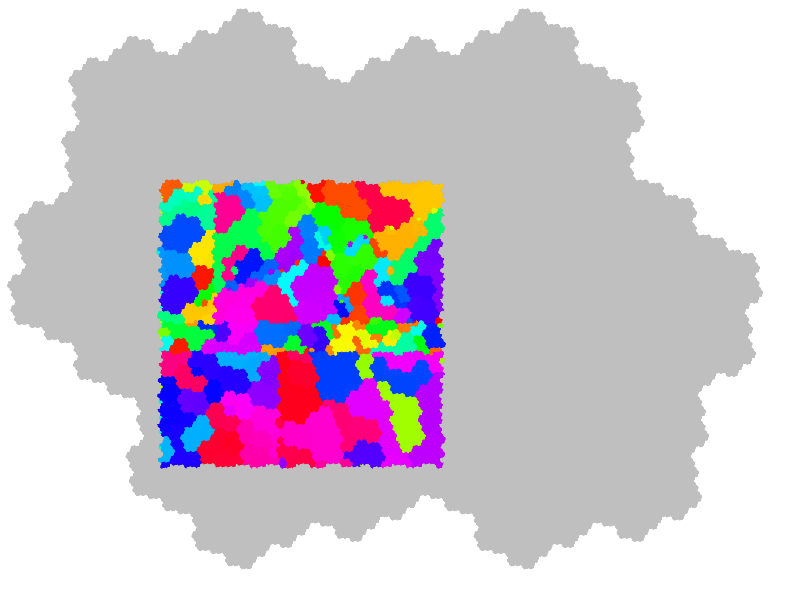

Any Shape
---------

.. code-block:: Python

     #########################################
     # choose a Pisot number and an alphabet #
     #########################################
     pi = x^3-x^2-x-1 #Tribonacci
     #pi = x^3-2*x^2-x-1
     print pi.roots(ring=CC)
     b = pi.roots(ring=QQbar)[1][0] #we take the conjugate of modulus < 1 in order to plot the result
     print b
     m = BetaAdicSet(b, {0,1}) #choose the alphabet
     pm = m.b.parent().places()[1]

     aoc = m.user_draw()

Imported Image
--------------

.. code-block:: Python

     from sage.arith.beta_adic import ImageIn
     im = ImageIn('gabian.png') 
     im
     Image of size 573x628
     #compute a g-b-set approximating the image 
     w = im.width() 
     h = im.height() 
     ma = max(w,h) 

     #compute the canonical g-b-expansion of this g-b-set aoc 
     m = WordMorphism('a->ab,b->ac,c->a').DumontThomas().mirror()
     pm = m.b.parent().places()[1]
     md  = m.approx(17, lambda x: (pm(x).conjugate()+.5*(1+I))*ma in im) 
     m.plot_list([md])

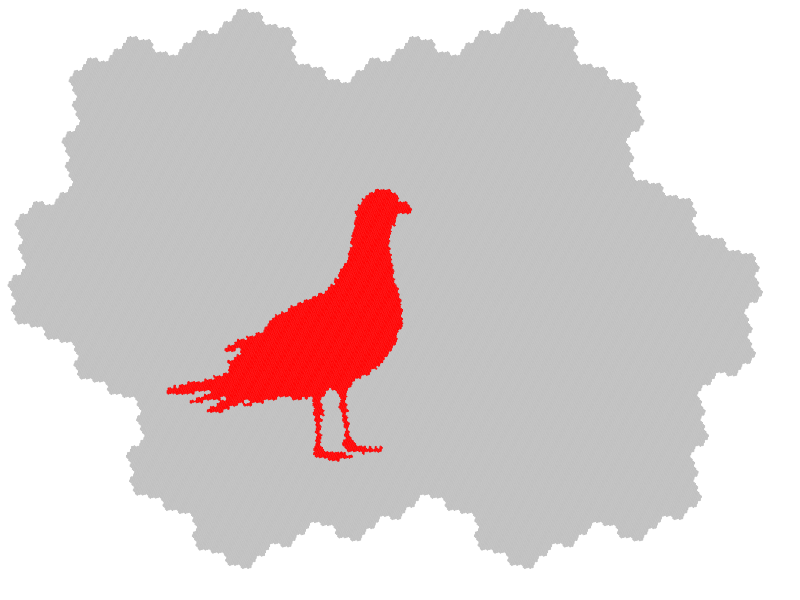

.. code-block:: Python
    
    m.relations_automaton().plot()

.. PLOT::
   :width: 50%

   m = WordMorphism('a->ab,b->ac,c->a').DumontThomas().mirror()
   a = m.relations_automaton()
   sphinx_plot(a)

Domain exchange with 17 pieces for the substitution
described in figure

.. code-block:: Python

   # compute a domain exchange
   l = md.domain_exchange()
   print("Exchange with %s pieces."%len(l))

   Exchange with 17 pieces.

.. code-block:: Python

   md = md.proj(m)
   md.plot_list([a for t,a in l], nprec=6)

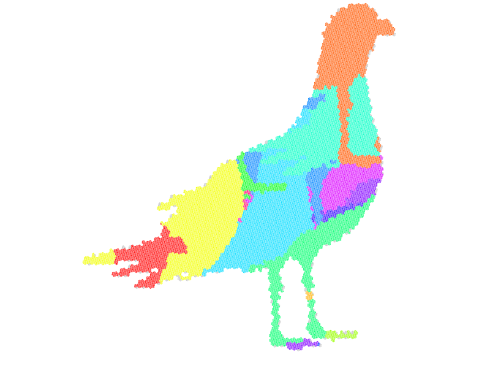

.. code-block:: Python

     # plot the domain exchange after exchange
     md.plot_list([a.proj(md, t) for t,a in l], nprec=6)

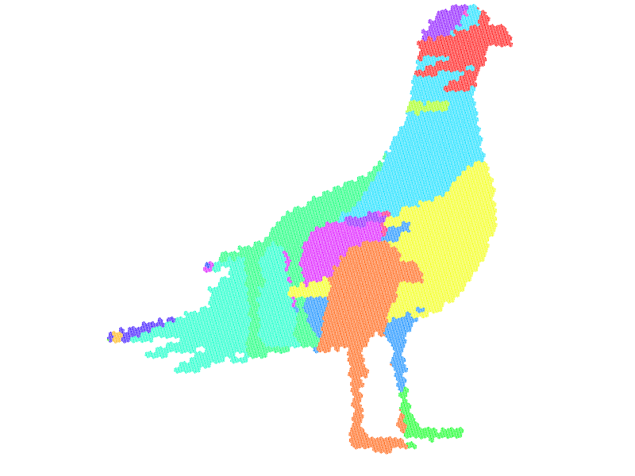

.. code-block:: Python

    d , lm = md.substitution(get_aut=True)
    d
    {1: [122, 137, 113, 64, 104, 142, 43, 107, 100, 47, 102, 10, 105, 131, 145, 128, 33, 78, 144, 39, 86, 63, 66, 153, 134, 69, 123, 110, 124,
    98],
    ...
    ...
    153: [121, 114, 89, 64, 103, 141, 81, 143, 99, 149, 11, 51, 148, 124, 79, 126, 76, 40, 63, 102, 136, 113, 64, 104, 96, 38, 107, 100, 20, 9,
    101, 74, 125, 84, 127, 147, 36, 130, 90, 112, 64, 103, 150, 16, 111, 143,  59, 17, 15, 58, 41, 6, 31, 140, 16, 129, 108, 37, 122, 137, 113,
    64, 104, 142, 43, 107, 100, 18, 8, 102, 45, 131, 64, 103, 128, 33, 78, 144, 12, 63, 66, 153, 134, 69, 123, 110, 124, 16, 129, 92, 93, 102,
    137, 113, 64, 104, 96, 1, 32, 107, 56, 67, 135, 101, 74, 125, 29]}
   
    md.plot_list([a for a,t in lm], nprec=6)

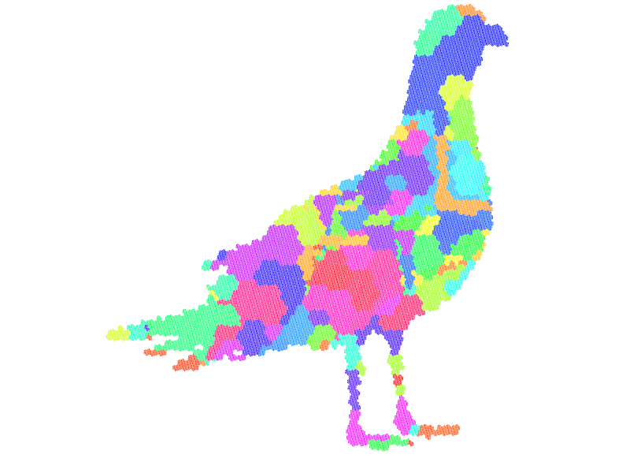

.. code-block:: Python

    s = WordMorphism(d)
    s.rauzy_fractal_plot()

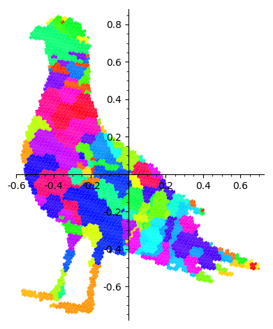

User Draw
---------

.. link

::

    sage: #########################################
    sage: # choose a Pisot number and an alphabet #
    sage: #########################################
    sage: pi = x^3-x^2-x-1 #Tribonacci
    sage: b = pi.roots(ring=QQbar)[1][0] #we take the conjugate of modulus < 1 in order to plot the result
    sage: m = BetaAdicSet(b, {0,1}) #choose the alphabet
    sage: pm = m.b.parent().places()[1]
    sage: aoc = m.user_draw()
    [(1.83928675521416, 1), (-0.419643377607081 - 0.606290729207199*I, 1), (-0.419643377607081 + 0.606290729207199*I, 1)]
    -0.4196433776070806? - 0.6062907292071993?*I
    sage: aoc.plot()

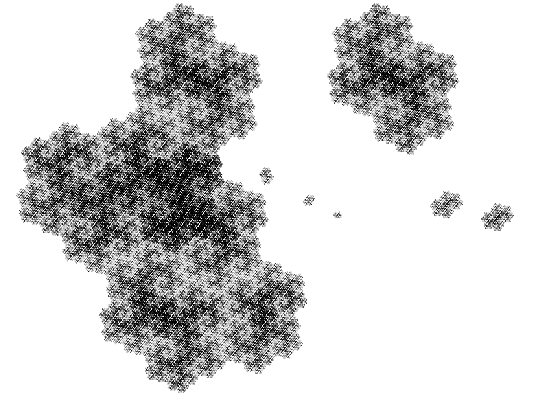

Compute the domain exchange

.. code-block:: Python

    # compute a domain exchange
    l = aoc.domain_exchange()
    print("Exchange with %s pieces."%len(l))
    Exchange with 13 pieces.

.. code-block:: Python

    # plot it
    aoc.plot_list([a for t,a in l], nprec=6)

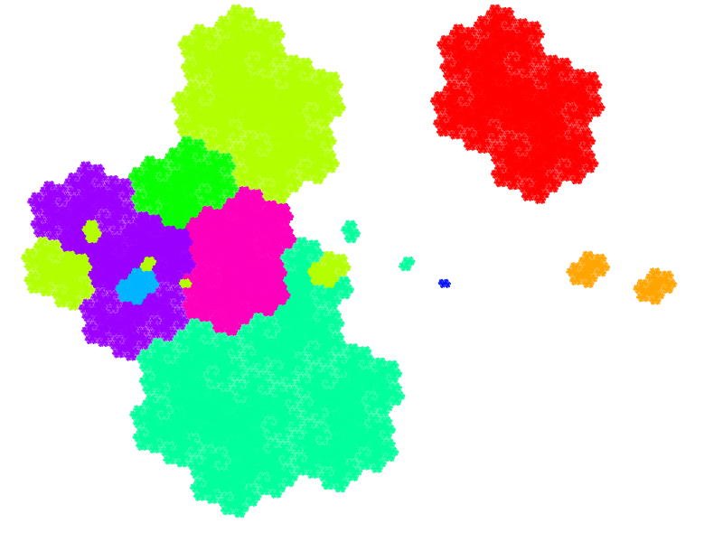

.. code-block:: Python

    # plot it after exchange
    aoc.plot_list([a.proj(m, t) for t,a in l], nprec=6)

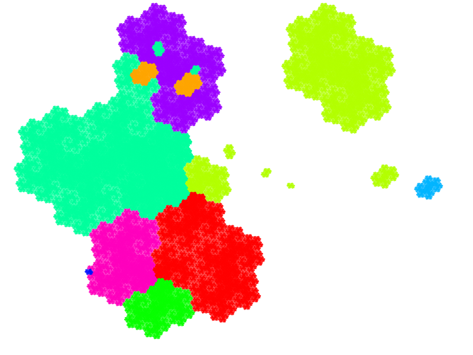

.. code-block:: Python

    aoc.relations_automaton()
    DetAutomaton with 7 states and an alphabet of 3 letters
    aoc.relations_automaton().plot()

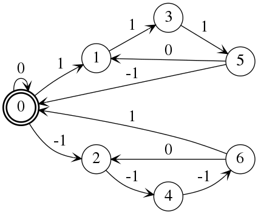

.. code-block:: Python

    aoc.reduced_words_automaton()
    DetAutomaton with 43 states and an alphabet of 2 letters
    aoc.reduced_words_automaton().plot()

.. image:: media/user51.png
  :scale: 70 %

.. code-block:: Python

    d , lm = aoc.substitution(get_aut=True)
    d
    {'a': ['o', 'm', 'e', 'r', 'g'],
     'b': ['m', 'b', 'j', 'e', 'r', 'g', 'm', 'p', 'm', 'q'],
     'c': ['m', 'b', 'j', 'e', 'r', 'g', 'm', 'o', 'j', 'e', 'r', 'g', 'm'],
     'd': ['o', 'm', 'q', 'i', 'r', 'g', 'm', 'b', 'j', 'e', 'r', 'g', 'm', 'p', 'm', 'q'],
     'e': ['m', 'b', 'j', 'e', 'r', 'g', 'm', 'o', 'j', 'e', 'r', 'g', 'm', 'o', 'm', 'e', 'r', 'g'],
     'f': ['l', 'd', 'm', 'q'],
     'g': ['p', 'm', 'q'],
     'h': ['o', 'j', 'e', 'r', 'g', 'm'],
     'i': ['o', 'j', 'e', 'r', 'g', 'm', 'o', 'm', 'e', 'r', 'g'],
     'j': ['h', 'a', 'r', 'g', 'j', 'e', 'r', 'f', 'm', 'o', 'm', 'e', 'r', 'g'],
     'k': ['k', 'j', 'e', 'r', 'g', 'm', 'o', 'm', 'e', 'r', 'g', 'm', 'b', 'j', 'e', 'r', 'g', 'm', 'p', 'm', 'q'],
     'l': ['m', 'b', 'j', 'c', 'a', 'r', 'g', 'm'],
     'm': ['i', 'r', 'g', 'j', 'e', 'r', 'g', 'm', 'o', 'm', 'e', 'r', 'g'],
     'n': ['i', 'r', 'g', 'j', 'q', 'i', 'r', 'g', 'm', 'o', 'm', 'e', 'r', 'g'],
     'o': ['m', 'b', 'j', 'c', 'a', 'r', 'g', 'm', 'o', 'm', 'e', 'r', 'g', 'm', 'b', 'j', 'e', 'r', 'g', 'm', 'p', 'm', 'q'],
     'p': ['m', 'b', 'j', 'c', 'a', 'r', 'g', 'm', 'o', 'm', 'q', 'i', 'r', 'g', 'm', 'b', 'j', 'e', 'r', 'g', 'm', 'p', 'm', 'q'],
     'q': ['m', 'b', 'j', 'e', 'r', 'g', 'm'],
     'r': ['n', 'b', 'j', 'e', 'r', 'g', 'm']}

.. code-block:: Python

    aoc.plot_list([a for a,t in lm], nprec=6)

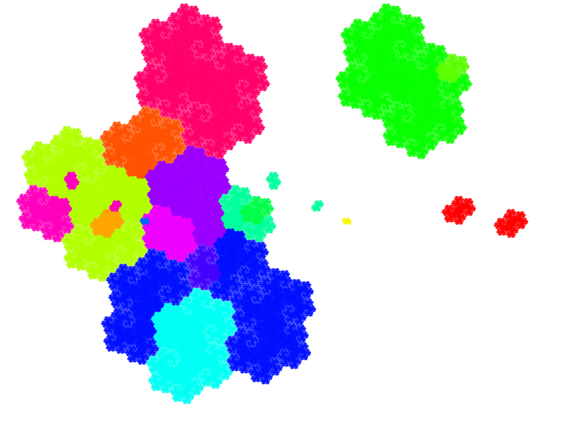

Intervals
---------

For any quadratic Pisot number :math:`\beta`,
the :math:`\beta`-adic set :math:`Q_{(-1,1)}` of all elements of the integer rings that are in the intervalle :math:`(-1,1)` in the contracting space, can be computed,
and then we can compute a substitution describing the quasicrystal.

